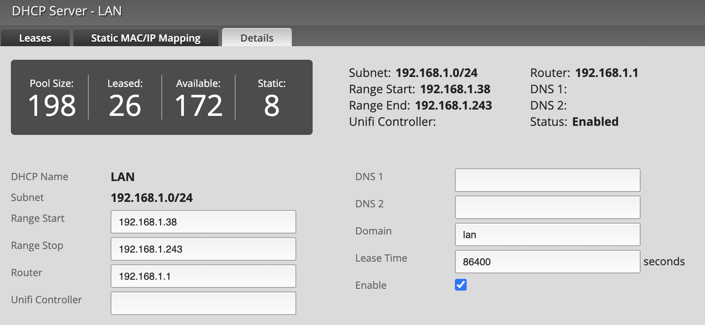

# Configuring Pi-Hole properly with dnsmasq

This documentation is expanded from [the pihole discourse docs](https://discourse.pi-hole.net/t/how-do-i-configure-my-devices-to-use-pi-hole-as-their-dns-server/245).  That document is great, but if you aren't already familiar with [dnsmasq](http://www.thekelleys.org.uk/dnsmasq/docs/dnsmasq-man.html) it may be confusing.

IMO, this is the **most proper** method of configuring a pihole.

## Goals

* to automatically configure DHCP clients to use a local pihole for DNS
* to use our router as a dnsmasq-based dhcp server (instead of using pihole for dhcp)
* to preserve hostname routing for hosts on your LAN, so you don't ever have to touch `/etc/hosts`
* to allow pihole logs to show queries based on hostname rather than IP.

## dnsmasq

dnsmasq is both a DNS *and* a DHCP server.  It does both, and we're going to use it for both.  What matters is the ordering.

DHCP servers handle assigning IP addresses to hosts on network. Since dnsmasq is both a DHCP server and a DNS resolver, it can remember what host it assigned what IP, so when you query for `myhost.lan`, dnsmasq will notice that it has a local record for `myhost` and return its local IP.

Here's how we want the query order to work:

``` plain
+------------------------------+
|                              |
| Internet (1.1.1.1)           |
|                              |
+-------------+----------------+
              ^
              |
+-------------+----------------+
|                              |
| Router (192.168.1.1)         |
|                              |
+-------------+----------------+
              ^
              |
              |
+-------------+----------------+
|                              |
| Pihole (192.168.1.33)        |
|                              |
+------------------------------+
```

### Setting dnsmasq options

We need to configure the router to tell DHCP clients that the local DNS server is pihole, at `192.168.1.33` (for example).  This happens when a client leases an IP, so after you change these settings, you may need to use `dhclient` to refresh your lease.

I have a Ubiquiti Edgerouter X, so [enabling dnsmasq](https://help.ui.com/hc/en-us/articles/115002673188-EdgeRouter-DHCP-Server-Using-Dnsmasq) is easy enough.

* Change dnsmasq's DNS forwarding to the public server you choose.  I like `1.1.1.2` from [cloudflare](https://blog.cloudflare.com/introducing-1-1-1-1-for-families/)
* Set dnsmasq `dhcp-option` option 6 `dns-server` to the IP of your Pi Hole.  `dhcp-option=6,192.168.1.33` is the likely syntax
* Set the system nameserver to be localhost, so all local DNS queries also go through dnsmasq.
* Set a local domain name, like `lan` so that all your hostnames will be accessible as `hostname.lan`.


My edgerouter config looks like this

``` conf
service {
    dhcp-server {
        disabled false
        shared-network-name LAN {
            authoritative enable
            subnet 192.168.1.0/24 {
                default-router 192.168.1.1
                domain-name lan
                lease 86400
                start 192.168.1.38 {
                    stop 192.168.1.243
                }
            }
        }
        static-arp disable
        use-dnsmasq enable
    }
    dns {
        forwarding {
            cache-size 150
            listen-on switch0
            name-server 1.1.1.2
            name-server 1.0.0.2
            options dhcp-option=6,192.168.1.33
        }
    }
}
system {
    name-server 127.0.0.1
}
```

## Pi Hole Config

Pihole will direct all un-blocked DNS to your router, the upstream dns server.

* Set your router IP as the only custom Upstream DNS Server
* Use DNSSEC
* Enable conditional forwarding and specify your local domain, `lan`


## Verifying it worked

https://askubuntu.com/questions/152593/command-line-to-list-dns-servers-used-by-my-system

```bash
# List interfaces
nmcli dev
# Show details
nmcli dev show eth0
# Look for "IP4.DNS", it should be your PiHole IP
```

In addition, try renewing a DHCP lease on a client to ensure the new lease is sending your PiHole's IP for the DNS server. If it's not working, check to make sure that the DHCP Server in `Services` has blank entries for both `DNS Server 1` and `DNS Server 2`. 



## DNS over TLS with Unbound

I followed [this guide from chameth.com](https://chameth.com/dns-over-tls-on-edgerouter-lite/).  Unlike Chris, I didn't want to _replace_ dnsmasq with unbound because I still wanted DHCP and automatic hostname resolution features that somehow only dnsmasq seems to provide.

Instead, I altered dnsmasq to unbind from all interfaces so that I could run dnsmasq only on `switch0` at 192.168.1.1 and 127.0.0.1. 

Now, I run unbound on 127.0.0.2 and forward queries that dnsmasq is unable to resolve on to unbound.  Here's my amended config.

``` conf
service{
   dns {
        forwarding {
            cache-size 150
            listen-on switch0
            name-server 127.0.0.2
            options dhcp-option=6,192.168.1.175,192.168.1.112
            options bind-interfaces
            options listen-address=127.0.0.1
            options listen-address=192.168.1.1
        }
    }
}
```

> About the only time when this is useful is when running another nameserver (or another instance of dnsmasq) on the same machine. Setting this option also enables multiple instances of dnsmasq which provide DHCP service to run in the same machine.

My unbound config can be found in [/etc/unbound.conf](/etc/unbound.conf)

## Redirect hard-coded DNS device queries to PiHole

The idea is to capture queries coming from stubborn IoT devices like smart speakers and smart TVs.  I cobbled this together from [a community thread](https://community.ui.com/questions/Intercepting-and-Re-Directing-DNS-Queries/cd0a248d-ca54-4d16-84c6-a5ade3dc3272)

``` conf
service {
    nat {
        rule 1002 {
            description "Redirect DNS"
            destination {
                port 53
            }
            inbound-interface switch0
            inside-address {
                address 192.168.1.175
                port 53
            }
            log disable
            protocol tcp_udp
            source {
                group {
                    address-group !DNS-Servers
                }
            }
            type destination
        }
        rule 5002 {
            description "Translate DNS to Internal reply"
            destination {
                group {
                    address-group DNS-Servers
                }
                port 53
            }
            log disable
            outbound-interface switch0
            protocol tcp_udp
            type masquerade
        }
        ...
    }
}
```

Note the address group.  You'll have to create a firewall address group:

``` conf
firewall {
    group {
        address-group DNS-Servers {
            address 192.168.1.175
            address 192.168.1.112
            description "Internal DNS servers"
        }
    }
}
```

## Adguard Home

You can specify your router's IP for LAN reverse resolution inside adguard.
